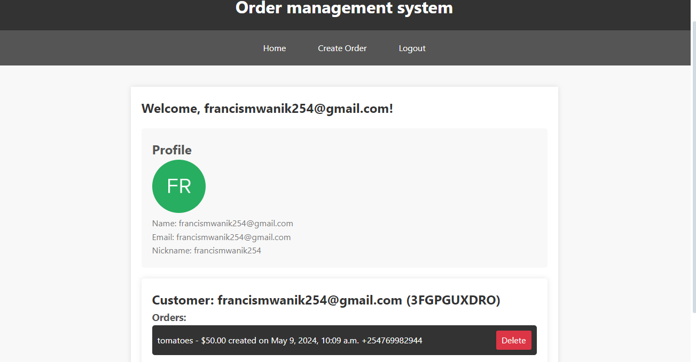
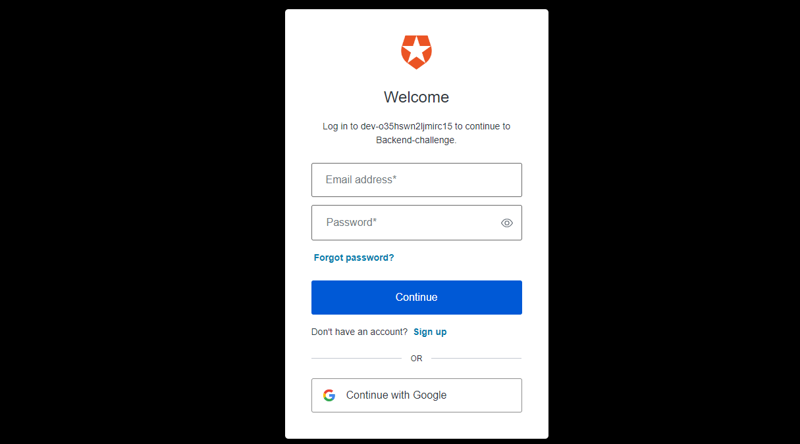
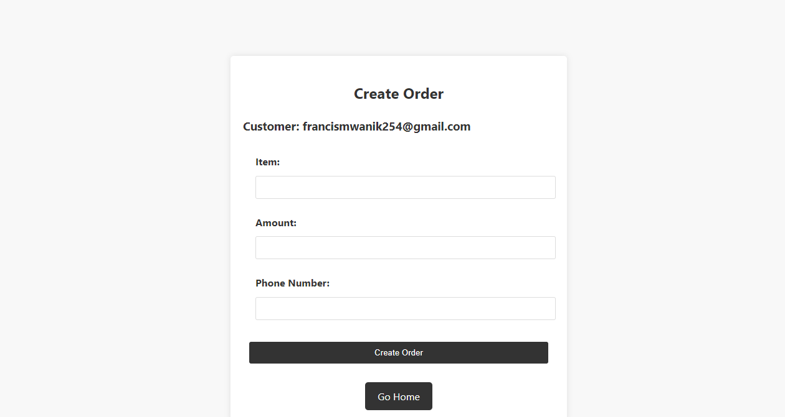
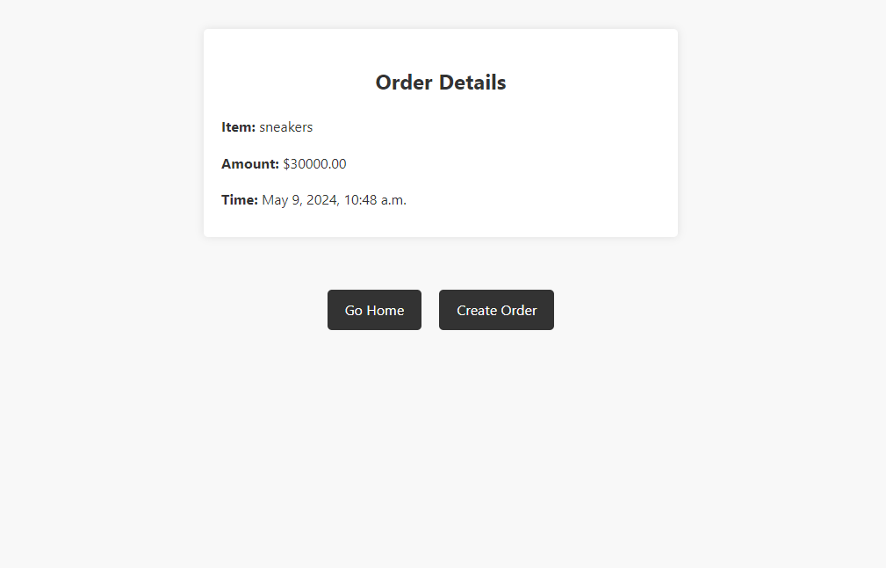
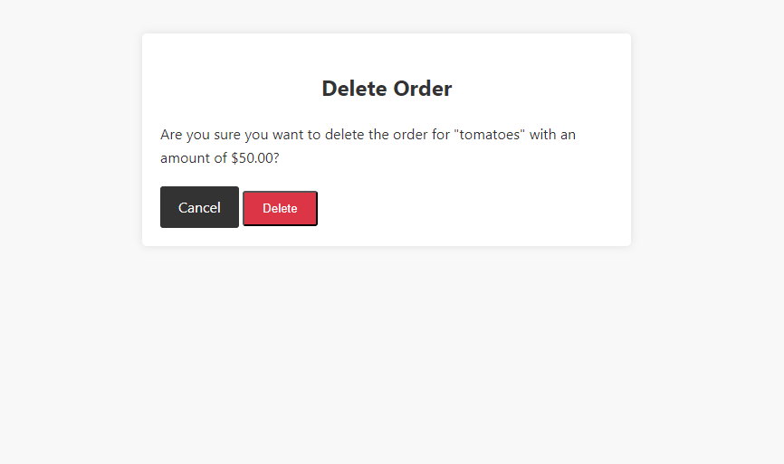

# Order Management System

The Order Management System is a Django-based web application that allows users to create, view, and delete orders. It also includes functionality to send SMS notifications to customers when an order is created, using the AfricasTalking API. The application is designed to be containerized with Docker and can be deployed using Kubernetes.

# Demo
 <h2>Home Page</h2>
<p align="center">
  
</p>
     <h2>Login Page</h2>
<p align="center" >
  
</p>
     <h2>Create Order Page</h2>
<p align="center">
    
</p>
     <h2>Order Details Page</h2>
<p align="center">
    
</p>
     <h2>Order Deletion</h2>
<p align="center">
    
</p>
## Table of Contents

- [Features](#features)
- [Prerequisites](#prerequisites)
- [Installation](#installation)
  - [Running Locally](#running-locally)
  - [Running with Docker](#running-with-docker)
  - [Running with Kubernetes](#running-with-kubernetes)
- [Usage](#usage)
- [Testing](#testing)
- [Deployment](#deployment)
  - [Docker](#docker)
  - [Kubernetes](#kubernetes)
- [Contributing](#contributing)
- [License](#license)

## Features

- User authentication and authorization using Auth0 via OPENID Connect
- Create new orders with customer details, item, and amount
- View order details
- Delete existing orders
- Send SMS notifications to customers upon order creation using the AfricasTalking API

## Prerequisites

Before running the project, ensure that you have the following installed:

- Python 3.x
- Django (version compatible with your Python version)
- An Auth0 account and API credentials
- An AfricasTalking account and API credentials
- Docker (if running with Docker or Kubernetes)
- Kubernetes cluster (if running with Kubernetes)

## Installation

### Running Locally

1. Clone the repository:

```
git clone git@github.com:Francis-Mwaniki/order-management-system.git
```

2. Navigate to the project directory:

```
cd order-management-system
```

3. Install the required Python packages:

```
pip install -r requirements.txt
```

4. Create a `.env` file in the project root directory and add the following environment variables:

```
AUTH0_CLIENT_ID=your_auth0_client_id
AUTH0_CLIENT_SECRET=your_auth0_client_secret
AUTH0_DOMAIN=your_auth0_domain
AFRICAS_TALKING_USERNAME=your_africastalking_username
AFRICAS_TALKING_API_KEY=your_africastalking_api_key
```

Replace the placeholders with your actual Auth0 and AfricasTalking credentials.

5. Run the Django migrations:

```
python manage.py migrate
```

6. Start the development server:

```
python manage.py runserver 3000
```

The application should now be running at `http://localhost:3000`.

### Running with Docker

<!-- deployed docker image franc254/order-mgt-system:latest -->
### Pulling the image from docker hub
```
docker pull franc254/order-mgt-system:latest
```
To run the application using Docker, follow these steps:

1. Build the Docker image:

```
docker build -t order-management-system .
```

2. Run the Docker container:

```
docker run -p 3000:8000 order-management-system
```

The application should now be running at `http://localhost:3000`.

### Running with Kubernetes

1. Build the Docker image:

```
docker build -t order-management-system .
```

2. Push the Docker image to a container registry (e.g., Docker Hub, Google Container Registry, etc.).

3. Create a Kubernetes deployment and service using the provided Kubernetes manifests (e.g., `deployment.yaml` and `service.yaml`).

4. Apply the manifests to your Kubernetes cluster:

```
kubectl apply -f deployment.yaml
kubectl apply -f service.yaml
```

5. Access the application using the assigned Kubernetes service URL or IP address.

## Usage

1. Navigate to the application URL in your web browser.
2. Click the "Login" button to authenticate with Auth0.
3. After successful authentication, you'll be redirected to the home page.
4. Click the "Create Order" button to create a new order.
5. Fill in the required details (customer, item, amount, and phone number), and click "Create Order".
6. Upon successful order creation, an SMS notification will be sent to the provided phone number using the AfricasTalking API.
7. You can view the order details on the home page.
8. To delete an order, click the "Delete" button next to the order you wish to remove.

## Testing

The project includes automated tests for the order management functionality. To run the tests, execute the following command:

```
python manage.py test myapp
```

Replace `myapp` with the name of your Django app.

## Deployment

### Docker

To deploy the application using Docker, follow these steps:

1. Build the Docker image:

```
docker build -t order-management-system .
```

2. Run the Docker container:

```
docker run -p 3000:8000 order-management-system
```

The application should now be accessible at `http://localhost:3000`.

### Kubernetes

To deploy the application using Kubernetes, follow these steps:

1. Build the Docker image:

```
docker build -t order-management-system .
```

2. Push the Docker image to a container registry (e.g., Docker Hub, Google Container Registry, etc.).

3. Create a Kubernetes deployment and service using the provided Kubernetes manifests (e.g., `deployment.yaml` and `service.yaml`).

4. Apply the manifests to your Kubernetes cluster:

```
kubectl apply -f deployment.yaml
kubectl apply -f service.yaml
```

5. Access the application using the assigned Kubernetes service URL or IP address.

## Contributing

Contributions are welcome! If you find any issues or have suggestions for improvements, please open an issue or submit a pull request.

